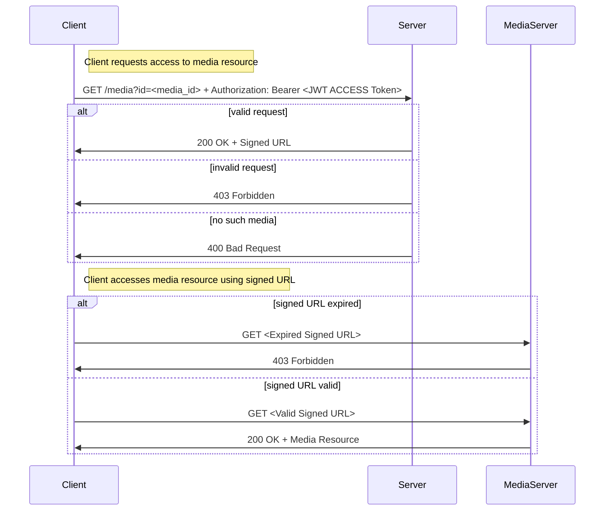

# Media access flow

Minimal media access flow using signed URLs:

Client requests signed and short-lived URL from server to access media chunks (which \<video\> tag will use seamlessly):

```mermaid
sequenceDiagram
    note right of Client: Client requests access to media resource
    Client->>Server: GET /media?id=<media_id> + Authorization: Bearer <JWT ACCESS Token>
    alt valid request
        Server->>Client: 200 OK + Signed URL
    else invalid request
        Server->>Client: 403 Forbidden
    else no such media
        Server->>Client: 400 Bad Request
    end
    note right of Client: Client accesses media resource using signed URL
    alt signed URL expired
        Client->>MediaServer: GET <Expired Signed URL>
        MediaServer->>Client: 403 Forbidden
    else signed URL valid
        Client->>MediaServer: GET <Valid Signed URL>
        MediaServer->>Client: 200 OK + Media Resource
    end
```
