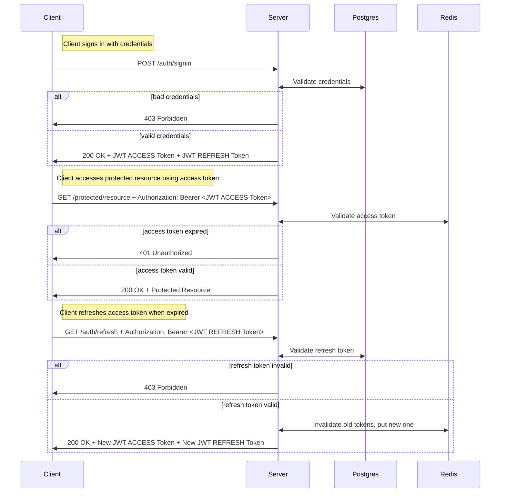

# Authentication flow

Minimal authentication flow using JWT access/refresh tokens:

> Note that JWT tokens contain userID and expiration time claims.

## Frontend

If JS has Access token, then User is considered authenticated.

- Access token keeps in JS memory (to obtain hit `/auth/refresh`)
- Refresh token keeps in HttpOnly Secure SameSite=strict cookie (to obtain hit `/auth/signin`)

## Backend

- Access token stored in Redis
- Refresh token stored in Postgres

## Sequence diagram

