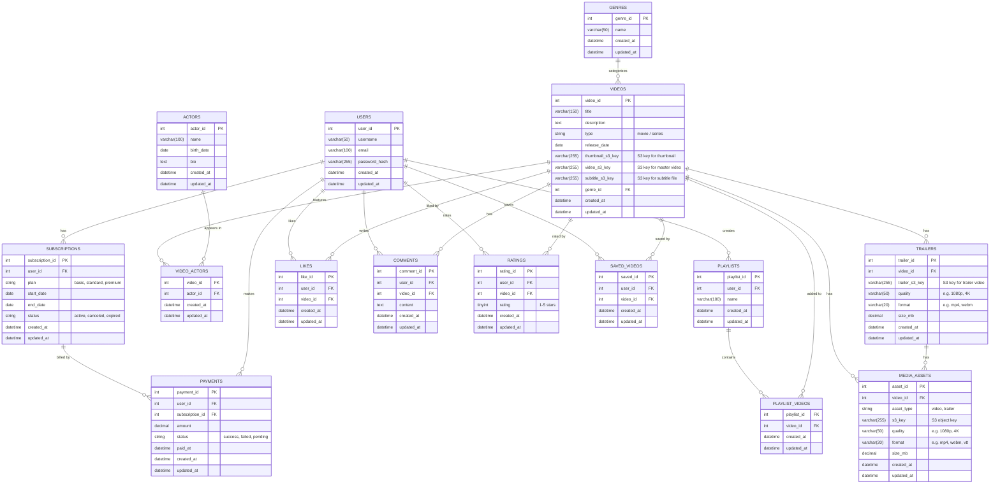

# ER диаграмма базы данных PopFilms

```mermaid
erDiagram
    USERS {
        int user_id PK
        varchar(50) username
        varchar(100) email
        varchar(255) password_hash
        datetime created_at
        datetime updated_at
    }

    GENRES {
        int genre_id PK
        varchar(50) name
        datetime created_at
        datetime updated_at
    }

%% Keep MEDIA_ASSETS to change quality of trailers, videos
%% Subtitles can have different languages, etc.
    VIDEOS {
        int video_id PK
        varchar(150) title
        text description
        string type          "movie / series"
        date release_date
        varchar(255) thumbnail_s3_key  "S3 key for thumbnail"
        varchar(255) video_s3_key      "S3 key for master video"
        varchar(255) subtitle_s3_key   "S3 key for subtitle file"
        int genre_id FK
        datetime created_at
        datetime updated_at
    }

    MEDIA_ASSETS {
        int asset_id PK
        int video_id FK
        string asset_type   "video, trailer"
        varchar(255) s3_key            "S3 object key"
        varchar(50) quality            "e.g. 1080p, 4K"
        varchar(20) format             "e.g. mp4, webm, vtt"
        decimal size_mb
        datetime created_at
        datetime updated_at
    }

%% FIXME: Add proper relations
%% Add subtitles, avatarts, etc tables

    TRAILERS {
        int trailer_id PK
        int video_id FK
        varchar(255) trailer_s3_key   "S3 key for trailer video"
        varchar(50) quality           "e.g. 1080p, 4K"
        varchar(20) format            "e.g. mp4, webm"
        decimal size_mb
        datetime created_at
        datetime updated_at
    }


    ACTORS {
        int actor_id PK
        varchar(100) name
        date birth_date
        text bio
        datetime created_at
        datetime updated_at
    }

    VIDEO_ACTORS {
        int video_id FK
        int actor_id FK
        datetime created_at
        datetime updated_at
    }

    PLAYLISTS {
        int playlist_id PK
        int user_id FK
        varchar(100) name
        datetime created_at
        datetime updated_at
    }

    PLAYLIST_VIDEOS {
        int playlist_id FK
        int video_id FK
        datetime created_at
        datetime updated_at
    }

    LIKES {
        int like_id PK
        int user_id FK
        int video_id FK
        datetime created_at
        datetime updated_at
    }

    COMMENTS {
        int comment_id PK
        int user_id FK
        int video_id FK
        text content
        datetime created_at
        datetime updated_at
    }

    RATINGS {
        int rating_id PK
        int user_id FK
        int video_id FK
        tinyint rating "1-5 stars"
        datetime created_at
        datetime updated_at
    }

    SAVED_VIDEOS {
        int saved_id PK
        int user_id FK
        int video_id FK
        datetime created_at
        datetime updated_at
    }

    SUBSCRIPTIONS {
        int subscription_id PK
        int user_id FK
        string plan        "basic, standard, premium"
        date start_date
        date end_date
        string status      "active, canceled, expired"
        datetime created_at
        datetime updated_at
    }

    PAYMENTS {
        int payment_id PK
        int user_id FK
        int subscription_id FK
        decimal amount
        string status      "success, failed, pending"
        datetime paid_at
        datetime created_at
        datetime updated_at
    }

    USERS ||--o{ PLAYLISTS : "creates"
    PLAYLISTS ||--o{ PLAYLIST_VIDEOS : "contains"
    VIDEOS ||--o{ PLAYLIST_VIDEOS : "added to"

    USERS ||--o{ LIKES : "likes"
    VIDEOS ||--o{ LIKES : "liked by"

    USERS ||--o{ COMMENTS : "writes"
    VIDEOS ||--o{ COMMENTS : "has"

    USERS ||--o{ RATINGS : "rates"
    VIDEOS ||--o{ RATINGS : "rated by"

    USERS ||--o{ SAVED_VIDEOS : "saves"
    VIDEOS ||--o{ SAVED_VIDEOS : "saved by"

    GENRES ||--o{ VIDEOS : "categorizes"
    VIDEOS ||--o{ MEDIA_ASSETS : "has"
    TRAILERS ||--o{ MEDIA_ASSETS : "has"
    VIDEOS ||--o{ TRAILERS : "has"
    VIDEOS ||--o{ VIDEO_ACTORS : "features"
    ACTORS ||--o{ VIDEO_ACTORS : "appears in"

    USERS ||--o{ SUBSCRIPTIONS : "has"
    SUBSCRIPTIONS ||--o{ PAYMENTS : "billed by"
    USERS ||--o{ PAYMENTS : "makes"

    
```